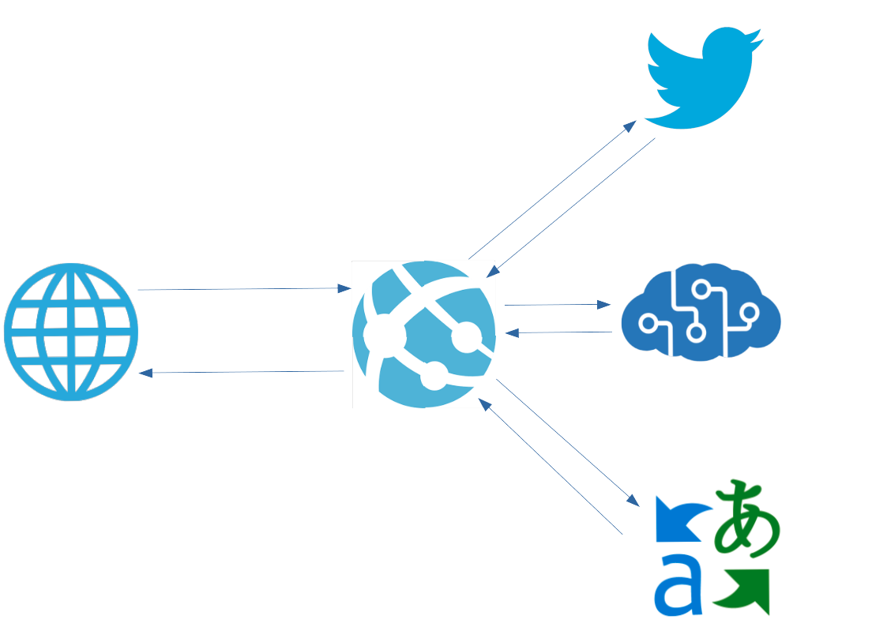
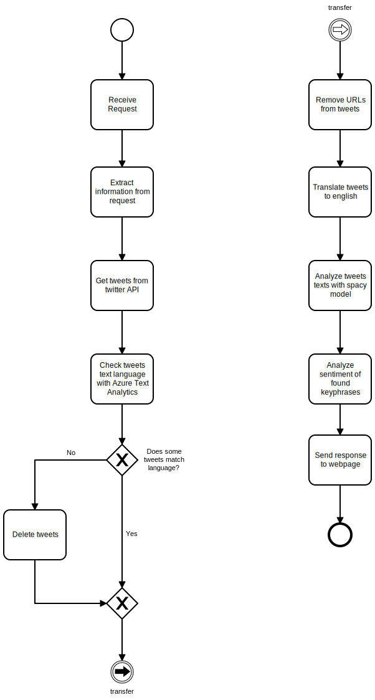
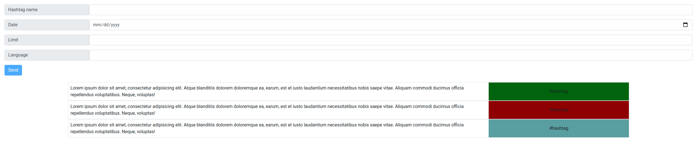

# TweetsSentimentAnalysis

## Description

This project refers to problem of analysing sentiment about some topics discussed on the internet. Main data source and best suitable social media is Twitter - place where chatting is everything. Given such comprehensive source of data we can model the process of sentiment extraction given many various intents. Please remark that analyzed tweets are going to be in polish.

## Architecture

The following image presents way in which our app works.

As shown above we access the main functionality through webpage. Webpage communicates with core app and waits for response.
After some computation and service work the webpage shows output of computation.

Basically we have developed our app basing on multiple Azure services. With use of these services we obtain our main goal which is predicting the sentiment of online tweets.

Azure services are used to complete the following tasks:
* detect language of tweets and measure sentiment of foudn phrases(Text Analytics 3.0)
* translate tweet from given language to english (Translate)

In original we thought about sending output of analysis to Cosmos DB, but in the end we decided to compute outcome and send it back to user as service is being called.

Original Architecture looked like the following one 

Database functionality is also implemented but not used in app. As a UI we decided to use webpage since we managed to simplify app logic so as not to use PowerBI or Power Apps.

## Computation Pipeline

The diagram presents the application flow structure. Diagram is presented in BPMN language.

## Web UI

This is how WebUI looks like.

The picture above shows how input fields for requests look like and how the incoming tweets are going to be presented.
Green color means positive sentiment, red negative and blue neutral.

## Code requirements

Code requirements are presented in this [file](src/code.md)
