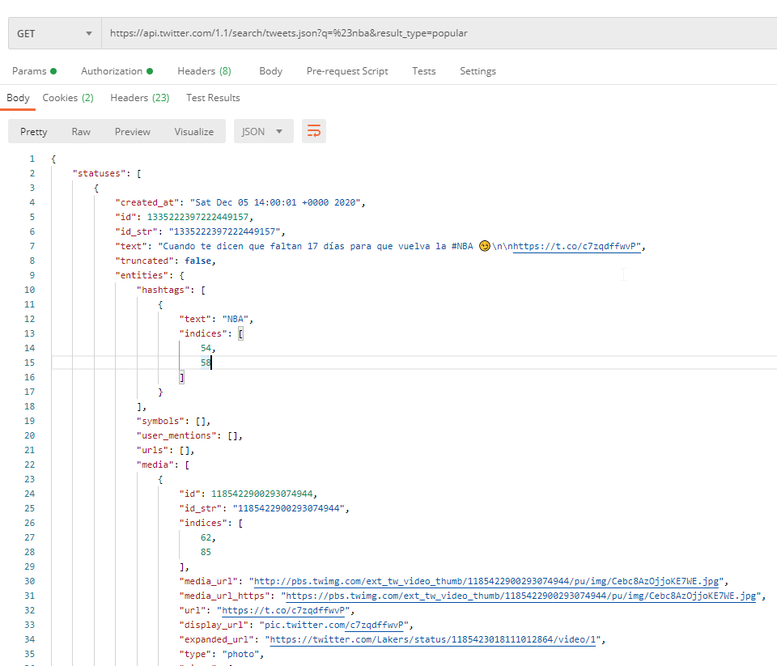

# TweetsSentimentAnalysis

## Description

This project refers to problem of analysing sentiment about some topics discussed on the internet. Main data source and best suitable social media is Twitter - place where chatting is everything. Given such comprehensive source of data we can model the process of sentiment extraction given many various intents. Please remark that analyzed tweets are going to be in polish.

## Program flow

The diagram presents the application flow structure.

Interpretation:

- Firstly we obtain a batch of tweets out of Twitter API. We most probably want to get tweets from a specific time interval. It optimises the use of database service, since no redundant attempts to add existing data.
- In this step we make some of preprocessing for example look for keywords, specific expressions in polish or words with the most sentiment value.
- Next step is text analytics. At this time we make use of Azure Services where text get translated to english and then sentiment is being measured.
- After receiving response, output data will be processed and combined with input tweet. In the end data is going to be added to database with all main extracted features
- Finally reports will be created in PowerApps. With use of Azure Functions we can get all the changes made to database or sum up any information from given time interval. Use of PowerApps shortens development of UI leaving user with decent experience.

## Data sources

Information about Tweet's hashtags we can find in "entities" JSON field.
API v1.1 provide searching by hashtags.

Subscriptions: https://developer.twitter.com/en/docs/twitter-api/v1/tweets/search/overview

How to build a standard query: https://developer.twitter.com/en/docs/twitter-api/v1/rules-and-filtering/guides/build-standard-queries

To build back-end application, we can use Azure FunctionApps or Azure container with custom server environment.

We get Tweets data from Twitter API in JSON object. In next step, the response must be processed to get data like Tweet Id, Tweet text, hashtags, author ect.
After that, the Tweets content will be sent to sentiment analysis. The response and Tweets data will be sent to database.

## Text Analytics Azure Services

## Data storage

## PowerApps reporting
