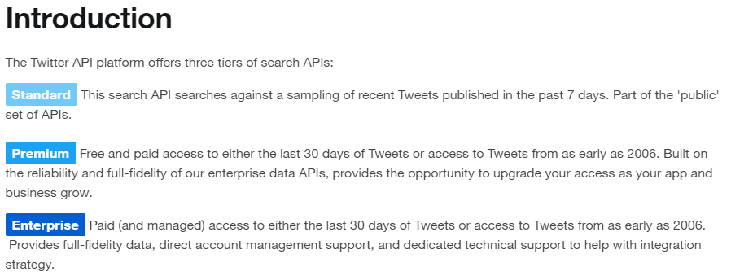

# TweetsSentimentAnalysis

The diagram presents the application architecture. 

### Data sources 

Information about Tweet's hashtags we can find in "entities" JSON field.
API v1.1 provide searching by hashtags.

Subscriptions: https://developer.twitter.com/en/docs/twitter-api/v1/tweets/search/overview

How to build a standard query: https://developer.twitter.com/en/docs/twitter-api/v1/rules-and-filtering/guides/build-standard-queries

To build back-end application, we can use Azure FunctionApps or Azure container with custom server environment. 

We get Tweets data from Twitter API in JSON object. In next step, the response must be processed to get data like Tweet Id, Tweet text, hashtags, author ect.
After that, the Tweets content will be sent to sentiment analysis. The response and Tweets data will be sent to database. 
