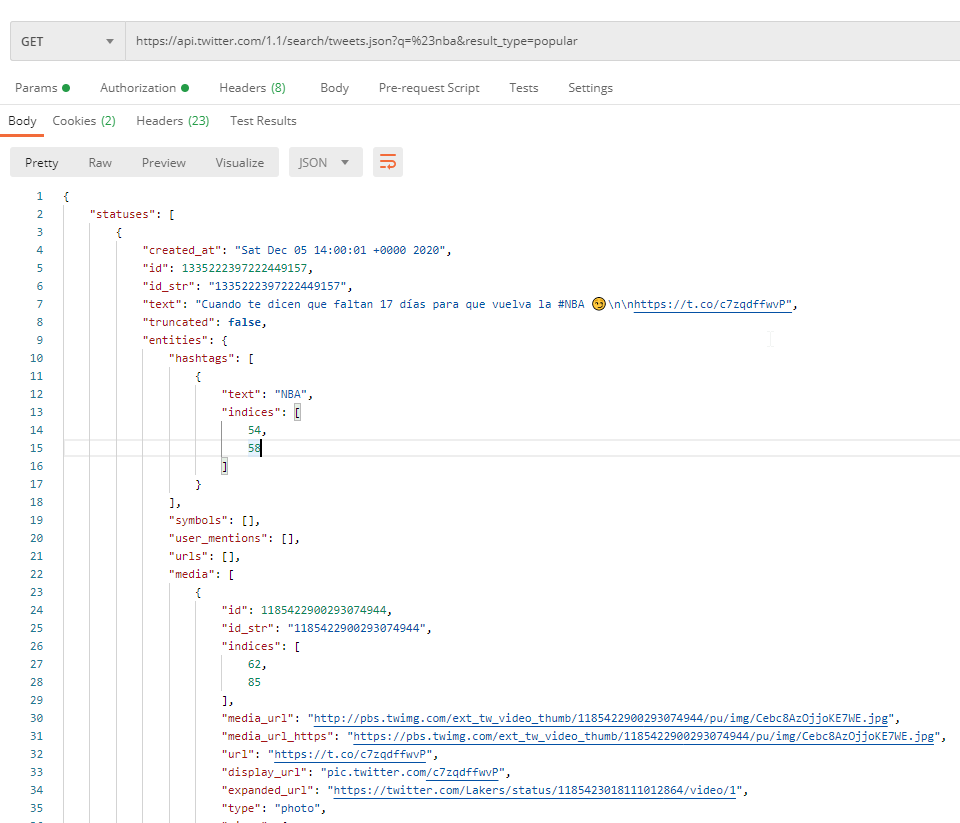
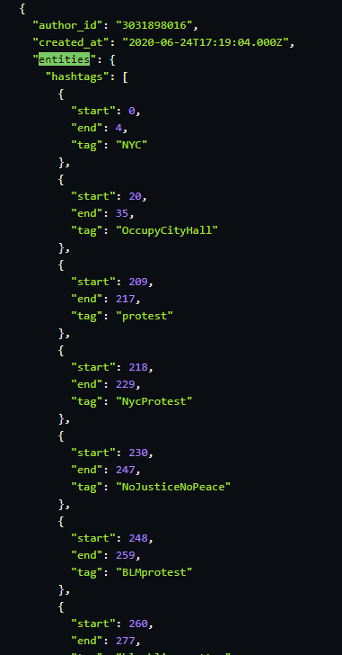
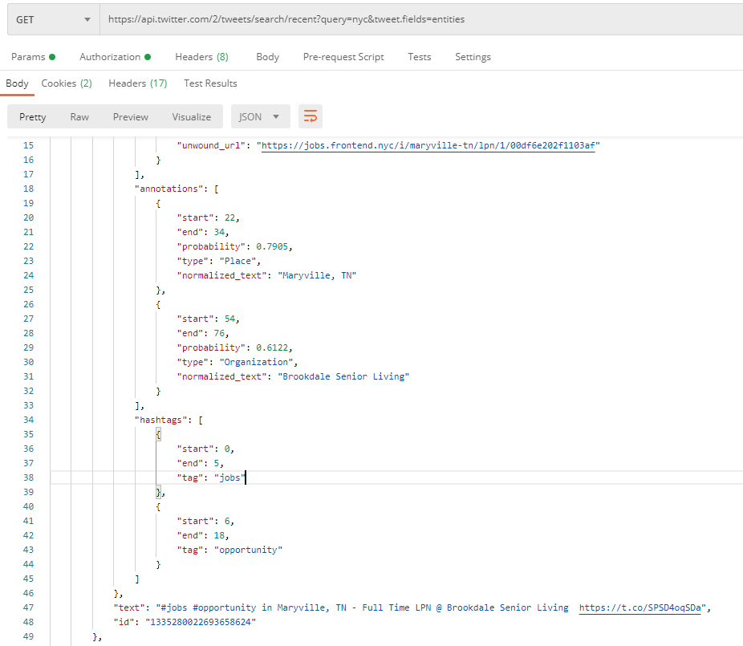
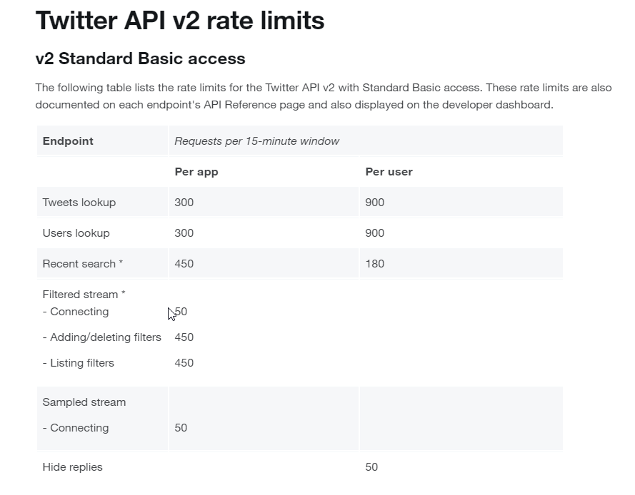

# Twitter API

## Twitter API v1.1

Information about Tweet's hashtags we can find in "entities" JSON field.
API v1.1 provide searching by hashtags.
Authorization realized by Bearer Token (form Developer portal).

Subscriptions: https://developer.twitter.com/en/docs/twitter-api/v1/tweets/search/overview
 

## Twitter API v2

Information about Tweet's hashtags we can find in "entities" JSON field.
 

https://developer.twitter.com/en/docs/twitter-api/data-dictionary/object-model/tweet
### Endpoints

Unfortunately, we can't search Tweets by hashtags. 

#### Recent Search 

Search for public Tweets created in the last 7 days.

Example: "https://api.twitter.com/2/tweets/search/recent?query=nyc&tweet.fields=entities"

In "query" param we have point a key words to look up in Tweet content. 
"tweet.fields=entities" respond "entities" field which contain e.g: hashtags, mentions... 

#### Multiple Tweets

This endpoint returns details about up to 100 Tweets specified by the requested IDs.

 

### Limits

